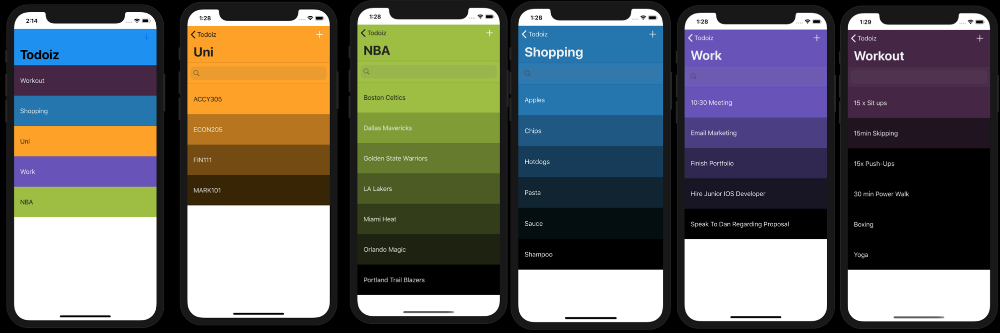

# Todoiz

## About
Todo-iz is a todo list application inspired by the clear todo app. It lets you make different todo lists items that show up as individual colours and when you add more items it creates an awesome gradient colour which goes from lighter to darker. 

## Tech
- This application incorporates the use of cocoaPods for the gradient feature and for the swipe to delete capability. 
- All of the data is saved and persisted locally to the Realm database. 
- Transferring data through multiple View Controllers.
- Implemting the proper use of the Model View Controller. MVC

## Screenshot

